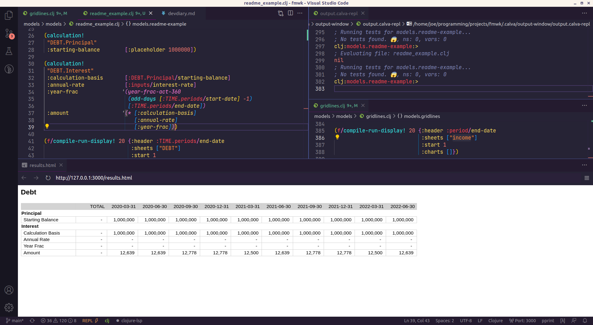
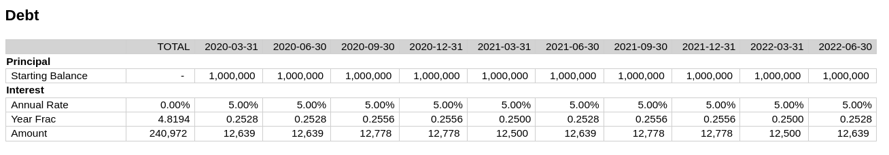

# Financial Modelling Framework

## Introduction
This is a program/framework to iteratively build and use 'project finance' type financial models as an alternative to Excel, the dominant method.

This is very much a prototype / proof of concept, and can and will change drastically.

## Why?
Excel is very good at building these type of models. In many ways it is one of the only 'killer apps' remaining to Excel as alternatives are found for visualization, reporting, and other types of financial modelling.

Above all, it is very flexible, which is well suited to the extremely diverse project-finance type models.

That being said, there are good reasons for looking at alternative ways of doing things. These types of models have grown to be extremely complex, with hundreds of inputs, thousands of rows, and incomprehensible dependency graphs. The modelling community has adapted to this complexity by developing standards and conventions to minimize the problems caused. This includes creating standard formats for different types of sheets, conventions around how formula are constructed, semantics for coloring and shading etc. Here are a few examples that I have seen:

* Formula must be consistent across a time-series
* Formula that are 'calculations' (i.e. have some arithmetic operations) must not have references to things outside of the sheet. Instead you should use dedicated 'import' rows.
* Linkages must be 'star' schemas. That is, you can't link to something which itself is a link to something else.
* The creation of 'template' sheets for common attributes, especially time related measure ("In operating period flag", "period end date") and financial statements.
* Placeholder have a yellow background.

While these conventions are broadly effective, all of these impose structure on the workbook, but rely on the discipline of the modeller to maintain them. This 'removal of flexibility' in exchange for simplicity is typical of the lifecycle of business process as patterns of use emerge and complexity increases. It is generally at that stage of the lifecycle that software emerges that implements and enforces those conventions.

This program is an attempt to do that for this domain.

## Inspiration
A model is a program, and the modeller is someone who creates that program. Each model is different, though (thanks to the conventions) created from largely homogeneous blocks. In this sense a modeller is more like a programmer than a 'user' of an application, like for example an accountant who is using accounting software to book journal entries. Following this analogy, a modeller doesn't need a 'user' program to help them construct models (such a program would necessarily impose too many restrictions on what a user can and can't do). They need an environment to create programs, in the same way that a software engineer uses an IDE.

There is a closer analogy that the one between a project finance modeller and a software engineer. In recent years, another type of model - the 'portfolio model' - has shown signs of moving away from Excel as its main modelling tool. These are analytical and predictive models of large portfolios of financial assets, for example credit cards. The credit card provider will send to the prospective financier 'data tapes' with historical data about the underlying assets. The financier will ingest, clean and analyze that data for things such as default rates, then build a predictive model on top of it based on assumed (or probabilistic) future default rates to determine its likely future cash-flows and assess whether it's a good investment for them.

The drive away from Excel for these types of models are based partly on increased statistical sophistication, requiring more advanced statistical tools, but mostly on the size of the data tapes. They can get extremely large, with hundreds of thousands of assets. This firstly has the consequence that Excel just can't _handle_ that amount of data well. Secondly, the challenge of cleaning the data is large, and Excel's tools for this are relatively rudimentary. And finally the amount of data means the value of being able to see all of it, on a line-by-line basis, is much diminished. When you have a million credit cards, the value of looking at a single credit card is minimal. Only aggregates are important. Excel... excels at showing you all the data, all the time. Since this is less necessary, the benefit of Excel is less.

The alternative tools to Excel that have been adopted are less like 'user applications', which would not be sufficiently flexible, and more similar to the tools that software engineers use. Data cleaning and manipulation and model building are done in general(ish) purpose programming languages like R and Python, with specialized libraries like R's Tidyverse and Python's Pandas. The tools are IDEs like R-Studio, or 'Notebooks' like Jupyter, which have the functionality of an IDE with integrated runtimes and better options for display. This solution doesn't reduce flexibility available to the user (arguably it increases it, since you have a full general purpose programming language at your disposal), while solving many of the above problems. 

A similar argument holds true for project finance modelling. For this reason the framework is premised on a user writing and running the model in code, from an IDE. The project finance model challenge does differ in several key ways, however. There is little input data, for example, typically just few scalars or vectors which are kept in an 'input' sheet. So the challenge of handling large input data volumes and cleaning that data is practically non-existent. The complexity of the project finance model is managing the large dependency graph between the different modelled attributes. It is easy to create circular dependencies, and hard to find out what they are, let alone fix them. This means the value of being able to see all the rows of a model is _more_ valuable, since you often need to 'debug' a model by following calculations around. This I think is why there has been less of a push to move away from spreadsheets for project finance models.

There remain some problems with spreadsheets for project finance models, which this framework aims to address:

1. Difficulty of version control
2. Lack of tools to trace cause (changes to the model) to effect (changes in the results)
3. Difficulty in handling circular references
4. Lack of comprehensibility on models above a certain size
5. A specific case of the above: Close coupling of model and output.

## Key concepts
There are a few concepts that are core to the understanding of this framework:

### The Time-series
All financial models are based on time series: what is the profit over time, what are the dividends over time, what is the balance-sheet over time. Almost everything in a financial model can be represented in a time series. In Excel, this takes the form of a time series 'sheet', with 'periods' across the top, named measures (_rows_) down the side, and the value of those measures in a time-series period in the intersection of these.

### The Model: Inputs and Model Rows
The model is a description of how to generate each row in the time series. For example, a description of a model for generating period start and end dates might be:

```
Inputs:
  model-start-date: 2020-01-01
  length-of-period: 3 months

Model Rows:
  period-number = previous period-number + 1
  period-start  = if   (period-number = 1) 
                  then model-start-date
                  else period-end + 1day
  period-end    = period-start + length-of-period
```

We see here a couple of key elements: There are **inputs**, which are static variables, and **model rows**, which define how to generate the time series for _period-number_, _period-start_ and _period-end_. Model rows are stated in terms of other model rows, and of inputs.

### Results
The results are the outcome of 'running' the model. Running the above model would give the following results:

```
period-number:      1          2          3          4     ...
period-start:  2020-01-01 2020-04-01 2020-07-01 2020-10-01 ...
period-end:    2020-03-31 2020-06-30 2020-09-30 2020-12-31 ...
```

### Outputs
A model is run for a reason: to see what the outputs are. These outputs are also useful when building the model to see what, in aggregate, has changed. There are typically stated in terms of aggregations of rows in results. Output definitions are part of the model definition, and are produced alongside the results as a outcome of running the model.

```
Outputs:
  blended-equity-irr: irr period-end cashflows-to-equity-holders
  total-dividends:    sum dividends
```

### Calculations and sheets
Theoretically the above gives you everything you need to build and run a model. However in practice building a model with hundreds of rows would quickly get too confusing. In Excel, modellers separate and group the rows in their model, by putting them in different sheets or tabs (e.g. the "equity" tab), and further group them within those sheets into smaller blocks, which I'll call _calculation blocks_ (for example, the 'dividend paid' calculation block).

These abstractions, which are effectively name-spacing the rows, provide some structure to the model which improves comprehensibility to the reader, and the ability to compartmentalize for the writer. We can do the same thing in the framework by name-spacing the rows.

```
INPUTS
  model-start-date = 2020-01-01
  length-of-period = 3 months

TIME.Periods:
  number      = previous number + 1
  start-date  = if   (number = 1) 
                then INPUTS/model-start-date
                else start-date + 1day
  end-date    = start-date + INPUTS/length-of-period

DEBT.Interest
  calculation-basis = DEBT.principal/starting-balance
  annual-rate       = INPUTS/interest-rate
  year-frac         = year-frac-act360
                        TIME.periods/start-date - 1
                        TIME.periods/end-date
  amount            = calculation-basis * annual-rate * year-frac
```

Each 'block' is a calculation block. The capitalized prefix (`TIME`) is equivalent to a 'sheet' in Excel, and the suffice (`Periods`) is the equivalent to a calculation block. Notice that now, where rows are referencing other rows they can either be local (`amount` in the `DEBT.Interest` block), or importing (`DEBT.principal.starting-balance`).

## Programming DSL
### Setup
The general purpose language chosen for writing and running the model is [Clojure](https://clojure.org/). Clojure is a mostly-functional Lisp which is hosted on the JVM. It was chosen for the following reasons:

1. REPL driven development, and excellent tooling for it, provides excellent interactive programming capabilities out of the box
2. [Homoiconicity](https://en.wikipedia.org/wiki/Homoiconicity) means that implementing what is effectively a DSL is extremely easy, and allows users to arbitrarily execute code and extend functionality within that DSL.
3. JVM hosting gives an excellent runtime, a lot of useful out of the box functionality, especially for date manipulation, and access to lots of libraries.

LISP syntax might be challenging for those coming from Python or R, but it is quite simple, especially since we use a very limited subset here.

You can use any IDE you like, but my recommendation is VSCode, because with [Calva](https://calva.io/get-started-with-clojure/) it has excellent REPL integration. I recommend setting up Calva to 'Evaluate on Save', which will in effect re-run your model whenever you hit Ctrl+S (which you should do a lot). Lastly, install the Microsoft Live Preview Extension (link below), which will be used to display model outputs.

Clone this repo and set up a new model (clj file) in the Models subfolder. At the top, put

```clojure
(ns models.readme-example
  (:require [fmwk.framework :as f :refer [base-case! calculation! bulk-metadata! metadata! cork-metadata! corkscrew! totalled-calculation! check! outputs!]]
            [fmwk.results-display :refer [print-result-summary!]]
            [fmwk.utils :refer [when-flag when-not-flag round mean]]
            [fmwk.dates :refer [year-frac-act-360 month-of add-days add-months date= date< date<= date> date>=]]
            [fmwk.irr :refer [irr-days]]))

(f/reset-model!)
```

Start the REPL following the Calva instructions. Now you're ready to start building the model.

### Coding and running the model
All of the above examples have been in pseudo-code. The framework implements a DSL for writing these models. The full source code for this model is at [This link](./models/models/readme_example.clj)[^2]

[^2]: That folder also has several other sample models you can look at.

```clojure
(base-case!
 "base-case"
 :model-start-date "2020-01-01"
 :length-of-period 3
 :interest-rate    0.05)

(calculation!
 "TIME.Periods"
 :number                   '(+ 1 [:number :prev])
 :start-date               '(if (= 1 [:number])
                              [:inputs/model-start-date]
                              (add-days [:end-date :prev] 1))
 :end-date                 '(-> [:start-date]
                                (add-months [:inputs/length-of-period])
                                (add-days -1)))

(calculation!
 "DEBT.Interest"
 :calculation-basis       [:DEBT.Principal/starting-balance]
 :annual-rate             [:inputs/interest-rate]
 :year-frac              '(year-frac-act-360
                           (add-days [:TIME.Periods/start-date] -1)
                           [:TIME.Periods/end-date])
 :amount                 '(* [:calculation-basis]
                             [:annual-rate]
                             [:year-frac]))
```

First we define our inputs - actually a "base-case", since we might want to create alternative sets of inputs later. Then we create two calculations: `TIME.Periods` and `DEBT.Interest`. Inside each calculation we define pairs of row-names, and their associated formula. These can either be direct references (like `calculation-basis`) or functions. A function is a Lisp S-Expression. The format is simply `(function-to-apply arg1 arg2 ...)`. It's entirely equivalent to `function-to-apply(arg1, arg2)` in Python, only the opening bracket comes _before_ the function call.

**Note the 'quote' before each S-Expression!** This is important because it defers the evaluation of the expression until you want to run the model. Every formula that isn't a direct reference needs to have one of these[^2].

[^2]: You can put them on references too if you like, but you don't need to.

The capitalization of the sheet, and the first-letter capitalizations of the calculation are just conventions which don't need to be followed for the model to work. You can also have more than two 'layers' of calculation if you want, though for legibility the output will only show headings for the first two levels.

Next, we can run the model with the following code:

```clojure
(compile-run-display! 20 {:header :TIME.periods/end-date
                          :sheets ["DEBT"]
                          :start 1
                          :charts []})
```

Here we run the model for 20 periods. The second argument provides some specifiers which determine the output we will see. If you actually try to run this model, however, you'll get the following error:

```
References to non-existant rows #:DEBT.Interest{:calculation-basis (:DEBT.Principal/starting-balance)}
```

We've tried to reference the starting balance of the debt, but we haven't defined it in our model. For now, we can just stub out a placeholder:

```clojure
(calculation!
 "DEBT.Principal"
 :starting-balance        [:placeholder 1000000])
```

Now if we run the model, we don't get any errors, but seemingly nothing happens. What has actually happened is that an html file called _results.html_ has been created and saved to your working directory. A good way to view this if your IDE is VSCode is to install a live-preview extension (Microsoft's [Live Preview](https://marketplace.visualstudio.com/items?itemName=ms-vscode.live-server) works fine), and load the html file. Then whenever you run the model, which if you've followed the above setup will be whenever you hit `Ctrl+s`, the results will be displayed in the live preview window.



Notice the correspondence between the options map and results:

```clojure
(compile-run-display! 20 {:header :TIME.periods/end-date
                          :sheets ["DEBT"]
                          :start 1
                          :charts []})
```

We specified the header as the period end date, and said we wanted to see the Debt sheet, and start at period 1 (The default is to display 10 periods). The results have done all that, including showing sub-headings for the two calculation, Principal and Interest.

However this doesn't look great. The Annual rate and Year Frac are not showing because they're being rounded to zero, there is no total for the interest amount, and the calculation basis is superfluous. We can fix this by adding some metadata:

```clojure
(metadata!
 "DEBT.Interest"
 :calculation-basis {:hidden true}
 :annual-rate       {:units :percent}
 :year-frac         {:units :factor :total true}
 :amount            {:units :currency :total true})
```



### More readme things to write
* Totals and Corkscrews
* Checks
* Outputs
* Charts
